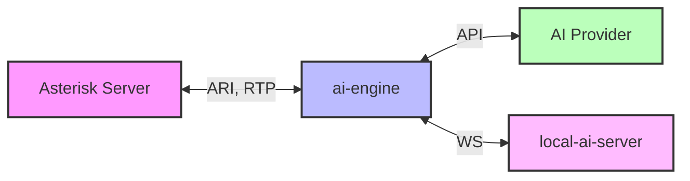

<div align="center">

# Asterisk AI Voice Agent


[](https://deepwiki.com/hkjarral/Asterisk-AI-Voice-Agent)
[](https://discord.gg/QhPSju6aCh)

The most powerful, flexible open-source AI voice agent for Asterisk/FreePBX. Featuring a **modular pipeline architecture** that lets you mix and match STT, LLM, and TTS providers, plus **5 production-ready golden baselines** validated for enterprise deployment.

[Quick Start](#-quick-start) • [Features](#-features) • [Demo](#-demo) • [Documentation](#-documentation) • [Community](#-community)

</div>

---

## 📖 Table of Contents

- [🚀 Quick Start](#-quick-start)
- [🎉 What's New](#-whats-new-in-v443)
- [🌟 Why Asterisk AI Voice Agent?](#-why-asterisk-ai-voice-agent)
- [✨ Features](#-features)
- [🎥 Demo](#-demo)
- [🛠️ AI-Powered Actions](#-ai-powered-actions-v43)
- [🩺 Agent CLI Tools](#-agent-cli-tools)
- [⚙️ Configuration](#-configuration)
- [🏗️ Project Architecture](#-project-architecture)
- [📊 Requirements](#-requirements)
- [🗺️ Documentation](#-documentation)
- [🤝 Contributing](#-contributing)
- [💬 Community](#-community)
- [📝 License](#-license)

---

## 🚀 Quick Start

Get up and running in **2 minutes** with the Admin UI.

### 1. Run Pre-flight Check

```bash
# Clone repository
git clone https://github.com/hkjarral/Asterisk-AI-Voice-Agent.git
cd Asterisk-AI-Voice-Agent

# Check system compatibility
./preflight.sh

# Auto-fix issues (optional)
./preflight.sh --apply-fixes
```

### 2. Start the Admin UI

```bash
# Start the Admin UI container
docker compose up -d admin-ui
```

### 3. Access the Dashboard

Open **[http://localhost:3003](http://localhost:3003)** in your browser.

- **Login**: `admin` / `admin` (Please change this immediately!)
- Follow the **Setup Wizard** to configure your providers and pipelines.

### 4. Connect Asterisk

The wizard will generate the necessary dialplan configuration for your Asterisk server.

---

## 🔧 Advanced Setup (CLI)

For users who prefer the command line or need headless setup.

### Option A: Interactive CLI
```bash
./install.sh
agent quickstart
```

### Option B: Manual Setup
```bash
# Configure environment
cp .env.example .env
# Edit .env with your API keys

# Start services
docker-compose up -d
```

### Configure Asterisk Dialplan
Add this to your FreePBX (`extensions_custom.conf`):
```asterisk
[from-ai-agent]
exten => s,1,NoOp(Asterisk AI Voice Agent v4.3)
 same => n,Stasis(asterisk-ai-voice-agent)
 same => n,Hangup()
```

### Test Your Agent
**Health check:**
```bash
agent doctor
```

**View logs:**
```bash
docker compose logs -f ai-engine
```

---

## 🎉 What's New in v4.5.0

<details open>
<summary><b>Latest Updates</b></summary>

### 🔧 Admin UI Stability (AAVA-129)
- **Atomic Config Writes**: Config files written via temp file + rename (prevents corruption).
- **Backup Rotation**: Only keeps last 5 backups per file.
- **Docker SDK Restarts**: Uses `container.restart()` instead of destructive stop/rm/up.
- **Toast Notifications**: Replaced browser `alert()` with inline notifications.
- **Input Focus Fix**: Environment page inputs no longer lose focus.

### 🛡️ Engine Stability
- **Timer Logging**: All timers log with `[TIMER]` prefix for easy filtering.
- **Health Improvements**: `/health` returns `uptime_seconds`, `pending_timers`, `active_sessions`.
- **Graceful Shutdown**: `docker stop` waits for active calls to complete (30s timeout).

</details>

<details>
<summary><b>Previous Versions</b></summary>

#### v4.4.3 - Cross-Platform Support
- **🌍 Pre-flight Script**: System compatibility checker with auto-fix mode.
- **🔧 Admin UI Fixes**: Models page, providers page, dashboard improvements.
- **🛠️ Developer Experience**: Code splitting, ESLint + Prettier.

#### v4.4.2 - Local AI Enhancements
- **🎤 New STT Backends**: Kroko ASR, Sherpa-ONNX.
- **🔊 Kokoro TTS**: High-quality neural TTS.
- **🔄 Model Management**: Dynamic backend switching from Dashboard.
- **📚 Documentation**: LOCAL_ONLY_SETUP.md guide.

#### v4.4.1 - Admin UI v1.0
- **🖥️ Admin UI v1.0**: Modern web interface (http://localhost:3003).
- **🎙️ ElevenLabs Conversational AI**: Premium voice quality provider.
- **🎵 Background Music**: Ambient music during AI calls.

#### v4.3 - Complete Tool Support & Documentation
- **🔧 Complete Tool Support**: Works across ALL pipeline types.
- **📚 Documentation Overhaul**: Reorganized structure.
- **💬 Discord Community**: Official server integration.

#### v4.2 - Google Live API & Enhanced Setup
- **🤖 Google Live API**: Gemini 2.0 Flash integration.
- **🚀 Interactive Setup**: `agent quickstart` wizard.

#### v4.1 - Tool Calling & Agent CLI
- **🔧 Tool Calling System**: Transfer calls, send emails.
- **🩺 Agent CLI Tools**: `doctor`, `troubleshoot`, `demo`.

</details>

---

## 🌟 Why Asterisk AI Voice Agent?

| Feature | Benefit |
|---------|---------|
| **Asterisk-Native** | Works directly with your existing Asterisk/FreePBX - no external telephony providers required. |
| **Truly Open Source** | MIT licensed with complete transparency and control. |
| **Modular Architecture** | Choose cloud, local, or hybrid - mix providers as needed. |
| **Production-Ready** | Battle-tested with validated configurations and enterprise monitoring. |
| **Cost-Effective** | Local Hybrid costs ~$0.001-0.003/minute (LLM only). |
| **Privacy-First** | Keep audio local while using cloud intelligence. |

---

## ✨ Features

### 5 Golden Baseline Configurations

1. **OpenAI Realtime** (Recommended for Quick Start)
   - Modern cloud AI with natural conversations (<2s response).
   - *Best for: Enterprise deployments, quick setup.*

2. **Deepgram Voice Agent** (Enterprise Cloud)
   - Advanced Think stage for complex reasoning (<3s response).
   - *Best for: Deepgram ecosystem, advanced features.*

3. **Google Live API** (Multimodal AI)
   - Gemini 2.0 Flash with multimodal capabilities (<2s response).
   - *Best for: Google ecosystem, advanced AI features.*

4. **ElevenLabs Agent** (Premium Voice Quality)
   - ElevenLabs Conversational AI with premium voices (<2s response).
   - *Best for: Voice quality priority, natural conversations.*

5. **Local Hybrid** (Privacy-Focused)
   - Local STT/TTS + Cloud LLM (OpenAI). Audio stays on-premises.
   - *Best for: Audio privacy, cost control, compliance.*

### 🆓 Free Demo Mode (No API Key Required)

For quick testing without any API keys, use the **`local_free`** pipeline:

```yaml
# In dialplan or via Admin UI
AI_PROVIDER=local_free
AI_CONTEXT=demo_free
```

**Features:**

- Uses [mlvoca.com](https://mlvoca.github.io/free-llm-api/) free LLM API (DeepSeek-R1 1.5b)
- Local Vosk STT + Free Cloud LLM + Local Piper TTS
- **No API key required** - works out of the box

**Limitations:**

- ❌ **No tool calling** - AI cannot hang up, transfer, or send emails
- ❌ User must hang up manually when done
- ⚠️ Limited hardware = slower responses during peak usage
- ⚠️ Non-commercial use only

> **For production use**, sign up for [OpenAI](https://platform.openai.com), [Groq](https://console.groq.com), or [Deepgram](https://deepgram.com) API keys to enable full functionality.

### Technical Features

- **Tool Calling System**: AI-powered actions (transfers, emails) work with any provider.
- **Agent CLI Tools**: `doctor`, `troubleshoot`, `demo`, `init` commands.
- **Modular Pipeline System**: Independent STT, LLM, and TTS provider selection.
- **Dual Transport Support**: AudioSocket (full agents) and ExternalMedia RTP (pipelines).
- **High-Performance Architecture**: Separate `ai-engine` and `local-ai-server` containers.
- **Enterprise Monitoring**: Prometheus + Grafana with 5 dashboards and 50+ metrics.
- **State Management**: SessionStore for centralized, typed call state.
- **Barge-In Support**: Interrupt handling with configurable gating.

### 🖥️ Admin UI v1.0

Modern web interface for configuration and system management.

**Quick Start:**
```bash
docker-compose up -d admin-ui
# Access at: http://localhost:3003
# Login: admin / admin (change immediately!)
```

**Key Features:**
- **Setup Wizard**: Visual provider configuration.
- **Dashboard**: Real-time system metrics and container status.
- **Live Logs**: WebSocket-based log streaming.
- **YAML Editor**: Monaco-based editor with validation.

---

## 🎥 Demo

[](https://youtu.be/ZQVny8wfCeY "Asterisk AI Voice Agent demo")

### 📞 Try it Live! (US Only)

Experience all four production-ready configurations with a single phone call:

**Dial: (925) 736-6718**

- **Press 5** → Google Live API (Multimodal AI with Gemini 2.0)
- **Press 6** → Deepgram Voice Agent (Enterprise cloud with Think stage)
- **Press 7** → OpenAI Realtime API (Modern cloud AI, most natural)
- **Press 8** → Local Hybrid Pipeline (Privacy-focused, audio stays local)

---

## 🛠️ AI-Powered Actions (v4.3+)

Your AI agent can perform real-world telephony actions through tool calling.

### Unified Call Transfers

```text
Caller: "Transfer me to the sales team"
Agent: "I'll connect you to our sales team right away."
[Transfer to sales queue with queue music]
```

**Supported Destinations:**
- **Extensions**: Direct SIP/PJSIP endpoint transfers.
- **Queues**: ACD queue transfers with position announcements.
- **Ring Groups**: Multiple agents ring simultaneously.

### Call Control & Voicemail

- **Cancel Transfer**: "Actually, cancel that" (during ring).
- **Hangup Call**: Ends call gracefully with farewell.
- **Voicemail**: Routes to voicemail box.

### Email Integration

- **Automatic Call Summaries**: Admins receive full transcripts and metadata.
- **Caller-Requested Transcripts**: "Email me a transcript of this call."

| Tool | Description | Status |
|------|-------------|--------|
| `transfer` | Transfer to extensions, queues, or ring groups | ✅ |
| `cancel_transfer` | Cancel in-progress transfer (during ring) | ✅ |
| `hangup_call` | End call gracefully with farewell message | ✅ |
| `leave_voicemail` | Route caller to voicemail extension | ✅ |
| `send_email_summary` | Auto-send call summaries to admins | ✅ |
| `request_transcript` | Caller-initiated email transcripts | ✅ |

---

## 🩺 Agent CLI Tools

Production-ready CLI for operations and setup.

**Installation:**
```bash
curl -sSL https://raw.githubusercontent.com/hkjarral/Asterisk-AI-Voice-Agent/main/scripts/install-cli.sh | bash
```

**Commands:**
```bash
agent quickstart          # Interactive setup wizard
agent dialplan            # Generate dialplan snippets
agent config validate     # Validate configuration
agent doctor --fix        # System health check
agent troubleshoot        # Analyze specific call
agent demo                # Demo features
```

---

## ⚙️ Configuration

### Two-File Configuration
- **[`config/ai-agent.yaml`](config/ai-agent.yaml)** - Golden baseline configs.
- **[`.env`](.env.example)** - Secrets and API keys (git-ignored).

**Example `.env`:**
```bash
OPENAI_API_KEY=sk-your-key-here
DEEPGRAM_API_KEY=your-key-here
ASTERISK_ARI_USERNAME=asterisk
ASTERISK_ARI_PASSWORD=your-password
```

### Optional: Enterprise Monitoring
Access Grafana at `http://your-server-ip:3000` (default: admin/admin).
```bash
docker compose -f docker-compose.monitoring.yml up -d
```

---

## 🏗️ Project Architecture

Two-container architecture for performance and scalability:

1. **`ai-engine`** (Lightweight orchestrator): Connects to Asterisk via ARI, manages call lifecycle.
2. **`local-ai-server`** (Optional): Runs local STT/TTS models (Vosk, Piper).



---

## 📊 Requirements

### Minimum System Requirements

| Type | CPU | RAM | Disk |
|------|-----|-----|------|
| **Cloud** (OpenAI/Deepgram) | 2+ cores | 4GB | 1GB |
| **Local Hybrid** | 4+ cores | 8GB+ | 2GB |

### Software Requirements
- Docker + Docker Compose
- Asterisk 18+ with ARI enabled
- FreePBX (recommended) or vanilla Asterisk

---

## 🗺️ Documentation

### Getting Started
- **[FreePBX Integration Guide](docs/FreePBX-Integration-Guide.md)**
- **[Installation Guide](docs/INSTALLATION.md)**

### Configuration & Operations
- **[Configuration Reference](docs/Configuration-Reference.md)**
- **[Transport Compatibility](docs/Transport-Mode-Compatibility.md)**
- **[Tuning Recipes](docs/Tuning-Recipes.md)**
- **[Monitoring Guide](docs/MONITORING_GUIDE.md)**

### Development
- **[Developer Documentation](docs/contributing/README.md)**
- **[Architecture Deep Dive](docs/contributing/architecture-deep-dive.md)**
- **[Contributing Guide](CONTRIBUTING.md)**

---

## 🤝 Contributing

Contributions are welcome! Please see our [Contributing Guide](CONTRIBUTING.md).

### 👩‍💻 For Developers
- [Developer Quickstart](docs/contributing/quickstart.md)
- [Developer Documentation](docs/contributing/README.md)

---

## 💬 Community

- **[Discord Server](https://discord.gg/CAVACtaY)** - Support and discussions
- [GitHub Issues](https://github.com/hkjarral/Asterisk-AI-Voice-Agent/issues) - Bug reports
- [GitHub Discussions](https://github.com/hkjarral/Asterisk-AI-Voice-Agent/discussions) - General chat

---

## 📝 License

This project is licensed under the MIT License. See the [LICENSE](LICENSE) file for details.

---

## 🙏 Show Your Support

If you find this project useful, please give it a ⭐️ on [GitHub](https://github.com/hkjarral/Asterisk-AI-Voice-Agent)!
